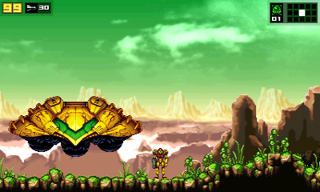
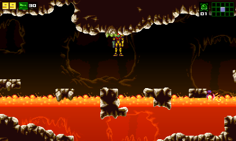
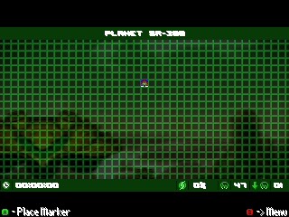

# AM2R for New 3DS

Play **AM2R** (Another Metroid 2 Remake) on your **New 3DS / New 2DS XL**.

> [!IMPORTANT]
> You need your own copy of AM2R. The game itself is not included.

## You need

- A New 3DS, New 3DS XL or New 2DS XL with custom firmware and **FBI** ([3ds.hacks.guide](https://3ds.hacks.guide)).
- Your copy of AM2R, updated with the [AM2R Launcher](https://github.com/AM2R-Community-Developers/AM2RLauncher).
- A Windows or Linux PC.

## Install

1. Download `am2r-sd.bat` (Windows) or `am2r-sd.sh` (Linux) from [Releases](../../releases) and run it. Follow
   what it asks, then copy the `3ds` folder it makes to your SD card.
2. Install `am2r.cia` with FBI.

That's it: AM2R is on your HOME Menu.

## Controls

| Button | Action |
|---|---|
| B | Jump |
| Y | Shoot |
| A | Morph Ball |
| L / ZL | Aim |
| R | Missiles |
| ZR | Aim lock |
| Select | Switch weapon |
| Start | Pause |

Tap the touch screen to open the map and pause menu.

## Problems?

Open an issue here and tell us what happened.

---

AM2R by DoctorM64 and team, with updates by the AM2R Community Developers. Not affiliated with Nintendo.
For developers: [.github/README.md](.github/README.md).
